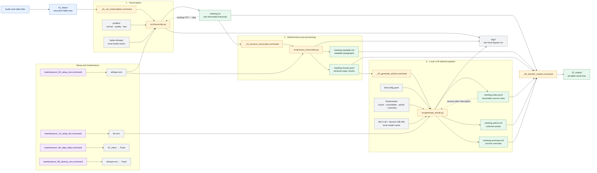

# Architecture

## Runtime and dependency architecture

```mermaid
flowchart TB
    USER["User · Finder or Terminal"]

    subgraph REPO["video-2-text repository"]
        direction TB

        subgraph COMMANDS["Shell entry points"]
            C1["_01_run_transcription.command"]
            C10["_10_process_transcripts.command"]
            C20["_20_generate_article.command"]
            C30["_30_transfer_results.command<br/>shell + rsync"]
            M0["maintenance/_00_setup_env.command"]
            M10["maintenance/_10_setup_llm.command"]
        end

        subgraph SOURCE["Application code"]
            PY1["src/transcribe.py"]
            PY10["src/process_transcripts.py"]
            PY20["src/generate_article.py"]
        end

        subgraph SETTINGS["Versioned configuration"]
            WP["profiles/*.yaml<br/>Whisper model and decoding"]
            LC["llm/config.yaml<br/>MLX model and generation limits"]
            LP["llm/prompts/*.md<br/>editorial rules"]
            R1["requirements.txt"]
            R2["requirements-llm.txt"]
        end

        subgraph DATA["Local working data · ignored by Git"]
            MEDIA["01_inbox/**/*.mp4 · audio"]
            RAW["*.txt"]
            READABLE["*.readable.md"]
            CHUNKS["*.chunks.jsonl"]
            NOTES["*.notes.jsonl"]
            ARTICLE["*.article.md"]
            SUMMARY["*.summary.md"]
            LOGS["logs/*.log"]
            OUTPUT["10_output/**<br/>copied result tree"]
        end
    end

    subgraph RUNTIMES["Isolated Python runtimes · ignored by Git"]
        direction LR
        subgraph WENV["whisper-env"]
            WPY["Python"]
            FW["faster-whisper"]
            CT2["CTranslate2"]
            AV["PyAV"]
            WY["PyYAML"]
            WPY --> FW
            FW --> CT2
            FW --> AV
            WPY --> WY
        end

        subgraph LENV["llm-env"]
            LPY["Python"]
            MLXLM["mlx-lm"]
            MLX["Apple MLX · Metal"]
            LY["PyYAML"]
            HF["huggingface-hub"]
            LPY --> MLXLM
            MLXLM --> MLX
            MLXLM --> HF
            LPY --> LY
        end
    end

    subgraph EXTERNAL["Local caches outside the repository"]
        WCACHE["Whisper large-v3 / turbo weights"]
        LCACHE["Qwen3-14B-4bit weights"]
    end

    USER --> C1
    USER --> C10
    USER --> C20
    USER --> C30
    USER --> M0
    USER --> M10

    M0 -->|"creates + installs R1"| WENV
    R1 --> M0
    M10 -->|"creates + installs R2"| LENV
    R2 --> M10
    M10 -.->|"first download"| LCACHE

    C1 -->|"whisper-env/bin/python"| PY1
    C10 -->|"whisper-env/bin/python"| PY10
    C20 -->|"llm-env/bin/python"| PY20

    WENV --> PY1
    WENV --> PY10
    LENV --> PY20

    WP --> PY1
    LC --> PY20
    LP --> PY20
    WCACHE --> FW
    LCACHE --> MLXLM

    MEDIA --> PY1 --> RAW
    RAW --> PY10
    PY10 --> READABLE
    PY10 --> CHUNKS
    CHUNKS --> PY20
    PY20 --> NOTES
    PY20 --> ARTICLE
    PY20 --> SUMMARY

    RAW --> C30
    READABLE --> C30
    CHUNKS --> C30
    NOTES --> C30
    ARTICLE --> C30
    SUMMARY --> C30
    C30 --> OUTPUT

    PY1 --> LOGS
    PY10 --> LOGS
    PY20 --> LOGS

    classDef command fill:#fff3d8,stroke:#c48816,color:#4b3400;
    classDef code fill:#e8f1ff,stroke:#3874cb,color:#10284a;
    classDef config fill:#f3eaff,stroke:#8055b5,color:#321653;
    classDef runtime fill:#e8f7ed,stroke:#318653,color:#123c22;
    classDef data fill:#f2f3f5,stroke:#747b86,color:#252a31;

    class C1,C10,C20,C30,M0,M10 command;
    class PY1,PY10,PY20 code;
    class WP,LC,LP,R1,R2 config;
    class WPY,FW,CT2,AV,WY,LPY,MLXLM,MLX,LY,HF runtime;
    class MEDIA,RAW,READABLE,CHUNKS,NOTES,ARTICLE,SUMMARY,LOGS,OUTPUT,WCACHE,LCACHE data;
```

## Data guarantees

- Raw media and `meeting.txt` remain unchanged during post-processing and article generation.
- Existing transcription, processing, and article outputs are skipped by default.
- `meeting.notes.jsonl` allows interrupted LLM generation to resume without repeating completed chunk work.
- Result transfer copies files into `10_output` without moving or deleting their sources.
- Media, transcripts, generated documents, environments, model caches, and logs remain local.
